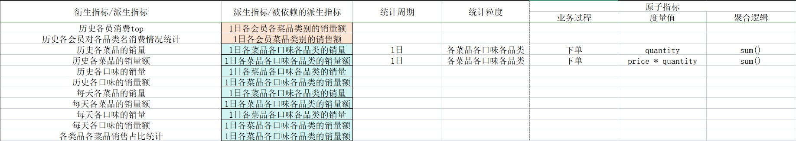

# 项目概述

本项目皆在为"私房小站"的餐饮数据，构建一个数据仓库，为数据分析，BI报表提供数据支撑，以及通过分析"私房小站"的餐饮数据来探索本企业的餐饮运营情况；

# 数据仓库架构


# 原始业务数据

原始业务表包含有：

- 订单信息表
- 订单详情表
- 菜品信息表
- 会员信息表

订单信息表：

| 字段               | 说明                        |
| ------------------ | --------------------------- |
| order_id           | 订单号                      |
| membee_name        | 会员名                      |
| shop_name          | 店铺名                      |
| shop_location      | 店铺所在地                  |
| order_time         | 点餐时间                    |
| consumption_amount | 消费金额                    |
| is_paid            | 是否结算：0.未结算.1.已结算 |
| payment_time       | 结算时间                    |

订单详情表：

| 字段      | 说明     |
| --------- | -------- |
| order_id  | 订单号   |
| dish_name | 菜品名称 |
| price     | 价格     |
| quantity  | 数量     |
| date      | 日期     |
| time      | 时间     |

菜品信息表：

| 字段                 | 说明     |
| -------------------- | -------- |
| dish_id              | 菜品id   |
| dish_name            | 菜品名称 |
| flavor               | 菜品口味 |
| price                | 价格     |
| cost                 | 成本     |
| recommendation_level | 推荐度   |
| dish_category        | 菜品类别 |

会员信息表：

| 字段                 | 说明     |
| -------------------- | -------- |
| member_id            | 会员号   |
| member_name          | 会员名   |
| gender               | 性别     |
| age                  | 年龄     |
| membership_join_date | 入会时间 |
| phone_number         | 手机号   |
| membership_level     | 会员等级 |

# ODS层表设计

对与原始业务数据，存储ODS层中，采用Doris的duplicate数据表模型，进行设计

ods_order_info(订单信息表):

| 字段               | 数据类型       | 说明                        |
| ------------------ | -------------- | --------------------------- |
| order_id           | bigint         | 订单号                      |
| member_name        | varchar(10)    | 会员名                      |
| shop_name          | varchar(32)    | 店铺名                      |
| shop_location      | varchar(10)    | 店铺所在地                  |
| order_time         | date           | 点餐时间                    |
| consumption_amount | decimal(16, 2) | 消费金额                    |
| is_paid            | int            | 是否结算：0.未结算.1.已结算 |
| payment_time       | date           | 结算时间                    |

ods_order_detail(订单详情表):

| 字段        | 数据类型       | 说明     |
| ----------- | -------------- | -------- |
| order_id    | bigint         | 订单号   |
| dish_name   | varchar(64)    | 菜品名称 |
| price       | decimal(16, 2) | 价格     |
| quantity    | int            | 数量     |
| detail_date | date           | 日期     |
| detail_time | time           | 时间     |

ods_dish_info(菜品信息表):

| 字段                 | 数据类型       | 说明     |
| -------------------- | -------------- | -------- |
| dish_id              | bigint         | 菜品id   |
| dish_name            | varchar(64)    | 菜品名称 |
| flavor               | varchar(10)    | 菜品口味 |
| price                | decimal(16, 2) | 价格     |
| cost                 | decimal(16, 2) | 成本     |
| recommendation_level | float          | 推荐度   |
| dish_category        | varchar(20)    | 菜品类别 |

ods_member_info(会员信息表):

| 字段                 | 数据类型    | 说明     |
| -------------------- | ----------- | -------- |
| member_id            | bigint      | 会员号   |
| member_name          | varchar(10) | 会员名   |
| gender               | varchar(3)  | 性别     |
| age                  | int         | 年龄     |
| membership_join_date | date        | 入会时间 |
| phone_number         | bigint      | 手机号   |
| membership_level     | varchar(10) | 会员等级 |

# 业务矩阵总线


# DWS与DIM层表设计

根据业务业务总线矩阵进行多维数据模型设计，设计事实表与维度表

## dim_member_info(会员维度表)

采用unique数据模型

| 字段                 | 数据类型    | 说明     |
| -------------------- | ----------- | -------- |
| member_id            | bigint      | 会员号   |
| member_name          | varchar(10) | 会员名   |
| gender               | varchar(3)  | 性别     |
| age                  | int         | 年龄     |
| membership_join_date | datetime    | 入会时间 |
| phone_number         | bigint      | 手机号   |
| membership_level     | varchar(10) | 会员等级 |

## dim_dish_info(菜品维度表)

使用unique数据模型

| 字段                 | 数据类型       | 说明     |
| -------------------- | -------------- | -------- |
| dish_id              | bigint         | 菜品id   |
| dish_name            | varchar(64)    | 菜品名称 |
| flavor               | varchar(10)    | 菜品口味 |
| price                | decimal(16, 2) | 价格     |
| cost                 | decimal(16, 2) | 成本     |
| recommendation_level | float          | 推荐度   |
| dish_category        | varchar(32)    | 菜品类别 |

## dwd_order_detail (下单明细事实表)

使用duplicate数据模型

| 字段               | 数据类型       | 说明                        |
| ------------------ | -------------- | --------------------------- |
| order_id           | bigint         | 订单id                      |
| menber_id          | bigint         | 会员id                      |
| dish_id            | bigint         | 菜品id                      |
| shop_name          | varchar(32)    | 店铺名                      |
| shop_location      | varchar(10)    | 店铺所在地                  |
| order_time         | datetime       | 点餐时间                    |
| payment_time       | datetime       | 结算时间                    |
| is_paid            | int            | 是否结算(0:未结算,1:已结算) |
| consumption_amount | decimal(16, 2) | 消费金额                    |
| price              | decimal(16, 2) | 单品价格                    |
| quantity           | int            | 数量                        |

# 统计指标需求

下列为统计指标需求

- 各菜品类别的销量top10
- 各菜品类别的销售额top10
- 各菜品类别的当月每天销量
- 各菜品类别的当月每天销售额
- 各城市盈利额top
- 各城市盈利额当月每天盈利额
- 各店铺盈利额top
- 各店铺盈利额当月每天盈利额
- 各店铺盈利额与各店铺盈利总额平均值对比(以各平均值为KPI标准)
- 各城市利额与各城市盈利总额平均值对比(以各平均值为KPI标准)
- 各会员对各菜品类名消费情况统计
- 各会员消费top10
- 各类品各菜品销售占比统计
- 各菜品销售情况统计top10
- 各口味销售情况统计top10

更深层次的分析

- 各会员按照口味偏好进行聚类分析

- 各会员按照品类编号进行聚类分析

- 各菜品之间相关性统计

- 菜品套餐组合分析

  ```txt
  1. 关联规则挖掘：
     - 使用关联规则学习（如Apriori算法或FP-Growth算法）来分析哪些菜品经常一起被顾客点选。
     - 设置合适的支持度（Support）和置信度（Confidence）阈值，以找出具有统计意义的菜品组合。
  
  2. 频繁项集分析：
     - 通过频繁项集分析来找出哪些菜品组合在订单中出现的频率最高。
     - 这可以帮助你识别出哪些菜品组合是顾客最喜欢的，从而构建出有吸引力的套餐。
  
  3. 时序分析：
     - 如果订单数据包含时间戳，可以进行时序分析来找出不同时间段（如早餐、午餐、晚餐）顾客点选菜品组合的习惯。
     - 这有助于餐厅在不同时间段推出符合顾客需求的套餐。
  ```



