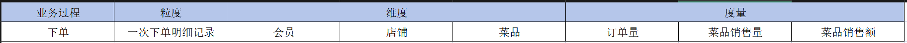
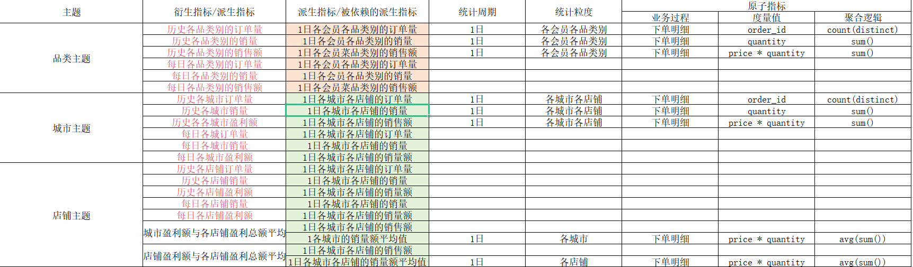
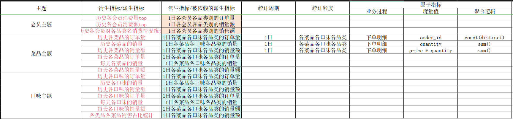

# 项目概述

本项目皆在为"私房小站"的餐饮数据，构建一个数据仓库，为数据分析，BI报表提供数据支撑，以及通过分析"私房小站"的餐饮数据来探索本企业的餐饮运营情况；

# 数据仓库架构


# 原始业务数据

原始业务表包含有：

- 订单信息表
- 订单详情表
- 菜品信息表
- 会员信息表

订单信息表：

| 字段               | 说明                        |
| ------------------ | --------------------------- |
| order_id           | 订单号                      |
| membee_name        | 会员名                      |
| shop_name          | 店铺名                      |
| shop_location      | 店铺所在地                  |
| order_time         | 点餐时间                    |
| consumption_amount | 消费金额                    |
| is_paid            | 是否结算：0.未结算.1.已结算 |
| payment_time       | 结算时间                    |

订单详情表：

| 字段      | 说明     |
| --------- | -------- |
| order_id  | 订单号   |
| dish_name | 菜品名称 |
| price     | 价格     |
| quantity  | 数量     |
| date      | 日期     |
| time      | 时间     |

菜品信息表：

| 字段                 | 说明     |
| -------------------- | -------- |
| dish_id              | 菜品id   |
| dish_name            | 菜品名称 |
| flavor               | 菜品口味 |
| price                | 价格     |
| cost                 | 成本     |
| recommendation_level | 推荐度   |
| dish_category        | 菜品类别 |

会员信息表：

| 字段                 | 说明     |
| -------------------- | -------- |
| member_id            | 会员号   |
| member_name          | 会员名   |
| gender               | 性别     |
| age                  | 年龄     |
| membership_join_date | 入会时间 |
| phone_number         | 手机号   |
| membership_level     | 会员等级 |

# ODS层表设计

对与原始业务数据，存储ODS层中，采用Doris的duplicate数据表模型，进行设计

ods_order_info(订单信息表):

| 字段               | 数据类型       | 说明                        |
| ------------------ | -------------- | --------------------------- |
| order_id           | bigint         | 订单号                      |
| member_name        | varchar(10)    | 会员名                      |
| shop_name          | varchar(32)    | 店铺名                      |
| shop_location      | varchar(10)    | 店铺所在地                  |
| order_time         | date           | 点餐时间                    |
| consumption_amount | decimal(16, 2) | 消费金额                    |
| is_paid            | int            | 是否结算：0.未结算.1.已结算 |
| payment_time       | date           | 结算时间                    |

ods_order_detail(订单详情表):

| 字段        | 数据类型       | 说明     |
| ----------- | -------------- | -------- |
| order_id    | bigint         | 订单号   |
| dish_name   | varchar(64)    | 菜品名称 |
| price       | decimal(16, 2) | 价格     |
| quantity    | int            | 数量     |
| detail_date | date           | 日期     |
| detail_time | time           | 时间     |

ods_dish_info(菜品信息表):

| 字段                 | 数据类型       | 说明     |
| -------------------- | -------------- | -------- |
| dish_id              | bigint         | 菜品id   |
| dish_name            | varchar(64)    | 菜品名称 |
| flavor               | varchar(10)    | 菜品口味 |
| price                | decimal(16, 2) | 价格     |
| cost                 | decimal(16, 2) | 成本     |
| recommendation_level | float          | 推荐度   |
| dish_category        | varchar(20)    | 菜品类别 |

ods_member_info(会员信息表):

| 字段                 | 数据类型    | 说明     |
| -------------------- | ----------- | -------- |
| member_id            | bigint      | 会员号   |
| member_name          | varchar(10) | 会员名   |
| gender               | varchar(3)  | 性别     |
| age                  | int         | 年龄     |
| membership_join_date | date        | 入会时间 |
| phone_number         | bigint      | 手机号   |
| membership_level     | varchar(10) | 会员等级 |

# 业务矩阵总线



# DWD与DIM层表设计

根据业务业务总线矩阵进行多维数据模型设计，设计事实表与维度表

## dim_member_info(会员维度表)

采用unique数据模型

| 字段                 | 数据类型    | 说明     |
| -------------------- | ----------- | -------- |
| member_id            | bigint      | 会员号   |
| member_name          | varchar(10) | 会员名   |
| gender               | varchar(3)  | 性别     |
| age                  | int         | 年龄     |
| membership_join_date | datetime    | 入会时间 |
| phone_number         | bigint      | 手机号   |
| membership_level     | varchar(10) | 会员等级 |

## dim_dish_info(菜品维度表)

使用unique数据模型

| 字段                 | 数据类型       | 说明     |
| -------------------- | -------------- | -------- |
| dish_id              | bigint         | 菜品id   |
| dish_name            | varchar(64)    | 菜品名称 |
| flavor               | varchar(10)    | 菜品口味 |
| price                | decimal(16, 2) | 价格     |
| cost                 | decimal(16, 2) | 成本     |
| recommendation_level | float          | 推荐度   |
| dish_category        | varchar(32)    | 菜品类别 |

## dwd_order_detail (下单明细事实表)

使用duplicate数据模型

| 字段               | 数据类型       | 说明                        |
| ------------------ | -------------- | --------------------------- |
| order_id           | bigint         | 订单id                      |
| menber_id          | bigint         | 会员id                      |
| dish_id            | bigint         | 菜品id                      |
| shop_name          | varchar(32)    | 店铺名                      |
| shop_location      | varchar(10)    | 店铺所在地                  |
| order_time         | datetime       | 点餐时间                    |
| payment_time       | datetime       | 结算时间                    |
| is_paid            | int            | 是否结算(0:未结算,1:已结算) |
| consumption_amount | decimal(16, 2) | 消费金额                    |
| price              | decimal(16, 2) | 单品价格                    |
| quantity           | int            | 数量                        |

# 统计指标需求

下列为统计指标需求

- 各菜品类别的销量top10
- 各菜品类别的销售额top10
- 各菜品类别的当月每天销量
- 各菜品类别的当月每天销售额
- 各城市盈利额top
- 各城市盈利额当月每天盈利额
- 各店铺盈利额top
- 各店铺盈利额当月每天盈利额
- 各店铺盈利额与各店铺盈利总额平均值对比(以各平均值为KPI标准)
- 各城市利额与各城市盈利总额平均值对比(以各平均值为KPI标准)
- 各会员对各菜品类名消费情况统计
- 各会员消费top10
- 各类品各菜品销售占比统计
- 各菜品销售情况统计top10
- 各口味销售情况统计top10

更深层次的分析

- 各会员按照口味偏好进行聚类分析

- 各会员按照品类偏好进行聚类分析

- 时间序列分析，预测未来7天的销量与销售额

- 各菜品之间相关性统计

- 菜品套餐组合分析

  ```txt
  1. 关联规则挖掘：
     - 使用关联规则学习（如Apriori算法或FP-Growth算法）来分析哪些菜品经常一起被顾客点选。
     - 设置合适的支持度（Support）和置信度（Confidence）阈值，以找出具有统计意义的菜品组合。
  
  2. 频繁项集分析：
     - 通过频繁项集分析来找出哪些菜品组合在订单中出现的频率最高。
     - 这可以帮助你识别出哪些菜品组合是顾客最喜欢的，从而构建出有吸引力的套餐。
  
  3. 时序分析：
     - 如果订单数据包含时间戳，可以进行时序分析来找出不同时间段（如早餐、午餐、晚餐）顾客点选菜品组合的习惯。
     - 这有助于餐厅在不同时间段推出符合顾客需求的套餐。
  ```





# DWS层表设计

## dws_member_dish_stat

采用aggregate数据模型，

| 字段          | 数据类型       | 列类型       | 聚合类型 | 描述           |
| ------------- | -------------- | ------------ | -------- | -------------- |
| member_id     | bigint         | key column   |          | 用户id         |
| member_name   | varchar(10)    | key column   |          | 用户名         |
| dish_category | varchar(32)    | key column   |          | 类品id         |
| pay_date      | date           | key column   |          | 支付日期       |
| order_count   | int            | value column | sum      | 订单量         |
| slaves_volume | int            | value column | sum      | 订单明细销量   |
| total_sales   | decimal(16, 2) | value column | sum      | 订单明细销售额 |

## dws_shop_city_stat

采用aggregate数据模型，1日各城市各店铺的stat

| 字段          | 数据类型       | 列类型       | 聚合类型 | 描述           |
| ------------- | -------------- | ------------ | -------- | -------------- |
| shop_location | varchar(10)    | key column   |          | 店铺所在地     |
| shop_name     | varchar(32)    | key column   |          | 店铺名         |
| pay_date      | date           | key column   |          | 支付日期       |
| order_count   | int            | value column | sum      | 订单量         |
| slaves_volume | int            | value column | sum      | 订单明细销量   |
| total_sales   | decimal(16, 2) | value column | sum      | 订单明细销售额 |

## dws_dish_stat

采用aggregate数据模型，1日各品类各口味各菜品的stat

| 字段          | 数据类型       | 列类型       | 聚合类型 | 描述           |
| ------------- | -------------- | ------------ | -------- | -------------- |
| dish_id       | bigint         | key column   |          | 菜品id         |
| dish_name     | varchar(64)    | key column   |          | 菜品名称       |
| flavor        | varchar(10)    | key column   |          | 菜品口味       |
| dish_category | varchar(32)    | key column   |          | 菜品类别       |
| pay_date      | date           | key column   |          | 支付日期       |
| order_count   | int            | value column | sum      | 订单量         |
| slaves_volume | int            | value column | sum      | 订单明细销量   |
| total_sales   | decimal(16, 2) | value column | sum      | 订单明细销售额 |

# ADS层表设计

## ads_dish_catagory_1day

采用aggregate数据模型，每日各品类别的销售指标

| 字段          | 数据类型       | 列类型       | 聚合类型 | 描述           |
| ------------- | -------------- | ------------ | -------- | -------------- |
| pay_date      | date           | key_column   |          | 支付日期       |
| dish_category | varchar(64)    | key_column   |          | 品类           |
| slaves_volume | int            | value_column | sum      | 订单明细销量   |
| total_sales   | decimal(16, 2) | value_column | sum      | 订单明细销售额 |

## ads_dish_category

历史累积品类指标，采用aggregate数据模型

```mysql
-- ads_dish_category 历史累积品类指标
drop table if exists ads_dish_category;
create table if not exists ads_dish_categroy(
    `dish_category` varchar(64) comment '品类',
    `order_count` int sum default '0' comment '订单量',
    `slaves_volume` int sum default '0' comment '销量',
    `total_sales` decimal(16, 2) sum default '0' comment '销售额'
)
aggregate key(`dish_category`)
distributed by hash(`dish_category`) buckets 1
properties(
    "replication_num" = "1"
);

create index dish_category_idx on ads_dish_categroy (dish_category) using bitmap comment 'dish_category列bitmap索引';
```

## ads_city_1day

每日城市的统计指标，采用aggreagte数据模型

```mysql
-- ads_city_1day 每日城市的统计指标
drop table if exists ads_city_1day;
create table if not exists ads_city_1day(
    `pay_date` date comment '支付日期',
    `shop_location` varchar(10) comment '店铺所在地',
    `order_count` int sum default '0' comment '订单量',
    `slaves_volume` int sum default '0' comment '销量',
    `total_sales` decimal sum default '0' comment '销售额'
)
aggregate key(`pay_date`, `shop_location`)
distributed by hash(`pay_date`) buckets 1
properties(
    "replication_num" = "1",
    "bloom_filter_columns" = "pay_date"
);

create index shop_location_idx on ads_city_1day (shop_location) using bitmap comment 'shop_location列bitmap索引';
```

## ads_city

历史累积城市的统计指标，采用aggregate数据模型

```mssql
-- ads_city 历史累积城市的统计指标
drop table if exists ads_city;
create table if not exists ads_city(
    `shop_location` varchar(10) comment '店铺所在地',
    `order_count` int sum default '0' comment '订单量',
    `slaves_volume` int sum default '0' comment '销量',
    `total_sales` decimal sum default '0' comment '销售额'
)
aggregate key(`shop_location`)
distributed by hash(`shop_location`) buckets 1
properties(
    "replication_num" = "1"
);

create index shop_location_idx on ads_city (shop_location) using bitmap comment 'shop_location列bitmap索引';
```

## ads_shop_1day

每日店铺的统计指标，采用aggregate数据模型

```mysql
-- ads_shop_1day 每日店铺的统计指标
drop table if exists ads_shop_1day;
create table if not exists ads_shop_1day(
    `pay_date` date comment '支付时间',
    `shop_name` varchar(32) comment '店铺名',
    `order_count` int sum default '0' comment '订单量',
    `slaves_volume` int sum default '0' comment '销量',
    `total_sales` decimal(16, 2) sum default '0' comment '销售额'
)
aggregate key(`pay_date`, `shop_name`)
distributed by hash(`pay_date`) buckets 1
properties(
    "replication_num" = "1",
    "bloom_filter_columns" = "pay_date"
);

create index if not exists shop_name_idx on ads_shop_1day (shop_name) using bitmap comment 'shop_name列bitmap索引';
```

## ads_shop

历史累积店铺的统计指标，采用aggregate数据模型

```mysql
drop table if exists ads_shop;
create table if not exists ads_shop(
    `shop_name` varchar(32) comment '店铺名',
    `order_count` int sum default '0' comment '订单量',
    `slaves_volume` int sum default '0' comment '销量',
    `total_sales` decimal(16, 2) sum default '0' comment '销售额'
)
aggregate key(`shop_name`)
distributed by hash(`shop_name`) buckets 1
properties(
    "replication_num" = "1"
);

create index if not exists shop_name_idx on ads_shop (shop_name) using bitmap comment 'shop_name列bitmap索引';
```

## ads_city_month

月季各城市盈利额与各城市盈利总额平均值对比，采用aggregate数据模型

```mysql
-- 月季各城市盈利额与各城市盈利总额平均值对比
drop table if exists ads_city_month;
create table if not exists ads_city_month(
    `month_date` varchar(10) comment 'yyyy-MM',
    `shop_location` varchar(10) comment '店铺所在地',
    `order_count` int sum default '0' comment '订单量',
    `slaves_volume` int sum default '0' comment '销量',
    `total_sales` decimal(16, 2) sum default '0' comment '销售额',
    `score` decimal(16, 2) sum default '0' comment 'kpi评分',
    `target` decimal(16, 2) replace default '58000' comment '目标值'
)
aggregate key(`month_date`, `shop_location`)
distributed by hash(`month_date`) buckets 1
properties(
    "replication_num" = "1"
);
```

## ads_shop_month

月季度各店铺盈利额与各店铺盈利总额平均值对比，采用aggregate数据模型

```mysql
-- ads_shop_month 月季度各店铺盈利额与各店铺盈利总额平均值对比
drop table if exists ads_shop_month;
create table if not exists ads_shop_month(
    `month_date` varchar(10) comment 'yyyy-MM',
    `shop_name` varchar(32) comment '店铺名',
    `order_count` int sum default '0' comment '订单量',
    `slaves_volume` int sum default '0' comment '销量',
    `total_sales` decimal(16, 2) sum default '0' comment '销售额',
    `score` decimal(16, 2) sum default '0' comment 'kpi评分',
    `target`  decimal(16, 2) replace default '0' comment '目标值'
)
aggregate key(`month_date`, `shop_name`)
distributed by hash(`month_date`) buckets 1
properties(
    "replication_num" = "1"
);
```

## ads_member

历史各会消费的统计指标，采用aggregate数据模型

```mysql
- 历史各会消费的统计指标
drop table if exists ads_member;
create table if not exists ads_member(
    `member_id` bigint comment '会员id',
    `member_name` varchar(10) comment '会员名',
    `order_count` int sum default '0' comment '订单量',
    `slaves_volume` int sum default '0' comment '销售量',
    `total_sales` decimal(16, 2) sum default '0' comment '销售额'
)
aggregate key(`member_id`, `member_name`)
distributed by key(`member_id`) buckets 1
properties(
    "replication_num" = "1",
    "bloom_filter_columns" = "member_id, member_name"
);
```

## ads_member_dish_category

历史至今各会员对品类消费情况，采用aggregate数据模型

```mysql
-- 历史至今各会员对品类消费情况
drop table if exists ads_member_dish_category;
create table if not exists ads_member_dish_category(
    `member_id` bigint comment '会员id',
    `member_name` varchar(10) comment '会员名',
    `dish_category` varchar(32) comment '品类',
    `order_count` int sum default '0' comment '订单量',
    `slaves_volume` int sum default '0' comment '销售量',
    `total_sales` decimal(16, 2) sum default '0' comment '销售额'
)
aggregate key(`member_id`, `member_name`, `dish_category`)
distributed by hash(`member_id`) buckets 1
properties(
    "replication_num" = "1",
    "bloom_filter_columns" = "member_id, member_name"
);
```

## ads_dish_name_1day

每日各菜品销售情况的统计指标，采用aggregate数据模型

```mysql
-- 每日各菜品销售情况的统计指标
drop table if exists ads_dish_name_1day;
create table if not exists ads_dish_name_1day(
    `pay_date` date comment '支付日期',
    `dish_id` bigint comment '菜品id',
    `dish_name` varchar(64) comment '菜品名称',
    `order_count` int sum default '0' comment '订单量',
    `slaves_volume` int sum default '0' comment '销售量',
    `total_sales` decimal(16, 2) sum default '0' comment '销售额'
)
aggregate key(`pay_date`, `dish_id`, `dish_name`)
distributed by hash(`pay_date`) buckets 1
properties(
    "replication_num" = "1"
);
```

## ads_dish_name_month

每月各菜品销售情况的统计指标，采用aggregate数据模型

```mysql
-- 每月各菜品销售情况的统计指标
drop table if exists ads_dish_name_month;
create table if not exists ads_dish_name_month(
    `month_date` varchar(10) comment 'yyyy-MM',
    `dish_id` bigint comment '菜品id',
    `dish_name` varchar(64) comment '菜品名称',
    `order_count` int sum default '0' comment '订单量',
    `slaves_volume` int sum default '0' comment '销售量',
    `total_sales` decimal(16, 2) sum default '0' comment '销售额'
)
aggregate key(`month_date`, `dish_id`, `dish_name`)
distributed by hash(`month_date`) buckets 1
properties(
    "replication_num" = "1"
);
```

## ads_dish_name

历史各菜品销售情况的统计指标，采用aggregate数据模型

```mysql
-- 历史各菜品销售情况的统计指标
drop table if exists ads_dish_name;
create table if not exists ads_dish_name(
    `dish_id` bigint comment '菜品id',
    `dish_name` varchar(64) comment '菜品名称',
    `order_count` int sum default '0' comment '订单量',
    `slaves_volume` int sum default '0' comment '销售量',
    `total_sales` decimal(16, 2) sum default '0' comment '销售额'
)
aggregate key(`dish_id`, `dish_name`)
distributed by hash(`dish_id`) buckets 1
properties(
    "replication_num" = "1"
);
```

## ads_flavor_1day

每日口味销售情况的统计指标，采用aggregate数据模型

```mysql
drop table if exists ads_flavor_1day;
create table if not exists ads_flavor_1day(
    `pay_date` date comment '支付时间',
    `flavor` varchar(32) comment '口味',
    `order_count` int sum default '0' comment '订单量',
    `slaves_volume` int sum default '0' comment '销售量',
    `total_sales` decimal(16, 2) sum default '0' comment '销售额'
)
aggregate key(`pay_date`, `flavor`)
distributed by hash(`pay_date`) buckets 1
properties(
    "replication_num" = "1"
);
```

## ads_flavor_month

每月口味销售情况的统计指标，采用aggregate数据模型

```mysql
drop table if exists ads_flavor_month;
create table if not exists ads_flavor_month(
    `month_date` varchar(10) comment 'yyyy-MM',
    `flavor` varchar(32) comment '口味',
    `order_count` int sum default '0' comment '订单量',
    `slaves_volume` int sum default '0' comment '销售量',
    `total_sales` decimal(16, 2) sum default '0' comment '销售额'
)
aggregate key(`month_date`, `flavor`)
distributed by hash(`month_date`) buckets 1
properties(
    "replication_num" = "1"
);
```

## ads_flavor

历史口味销售情况的统计指标，采用aggregate数据模型

```mysql
drop table if exists ads_flavor;
create table if not exists ads_flavor(
    `flavor` varchar(32) comment '口味',
    `order_count` int sum default '0' comment '订单量',
    `slaves_volume` int sum default '0' comment '销售量',
    `total_sales` decimal(16, 2) sum default '0' comment '销售额'
)
aggregate key(`flavor`)
distributed by hash(`flavor`) buckets 1
properties(
    "replication_num" = "1"
);
```

## ads_dish_category_name_month

每月各类品各菜品销售占比统计，采用aggregate数据模型

```mysql
drop table if exists ads_dish_category_name_month;
create table if not exists ads_dish_category_name_month(
    `date_month` varchar(10) comment 'yyyy-MM',
    `dish_category` varchar(32) comment '品类',
    `dish_name` varchar(64) comment '菜品',
    `total_sales` decimal(16, 2) replace default '0' comment '销售额',
    `total_sales_sum` decimal(16, 2) replace default '0' comment '品类总销售额',
    `proportion` decimal(16, 2) replace default '0' comment '占比'
)
aggregate key(`date_month`, `dish_category`, `dish_name`)
distributed by hash(`date_month`) buckets 1
properties(
    "replication_num" = "1"
);
```

# 探索性分析

## 聚类分析

利用Pyspark的ML对会员订单数据，进行聚类分析，主要进行会员口味与品类偏好进行聚类分析，探索各个会员群体；

采用Kmeans聚类算法，进行分析聚类分析

在进行聚类分析之前，需要对相关数据进行转换、处理，设计与开发相关表flavor_dic(口味字典表)，dish_category_dic(品类字典)、data_analysis_member_flavor_pre(会员口味偏好统计)、da_member_category_pre(会员品类偏好统计)

**flavor_dic(口味字典表)**

```mysql
drop table if exists flavor_dic;
create table if not exists flavor_dic(
    `id` int comment 'id',
    `base_flavor` varchar(10) comment '基础口味',
    `composite_flavor` varchar(10) comment  '复合口味'
)
unique key(`id`)
distributed by hash(`id`) buckets 1
properties(
    "replication_num" = "1"
);
```

**dish_category_dic(品类字典)**

```mysql
drop table if exists dish_category_dic;
create table if not exists dish_category_dic(
    `id` int comment 'id',
    `base_category` varchar(32) comment '基础品类',
    `composite_category` varchar(32) comment '细分品类'
)
unique key(`id`)
distributed by hash(`id`) buckets 1
properties (
    "replication_num" = "1"
);
```

**data_analysis_member_flavor_pre(会员口味偏好统计)**

```mysql
drop table if exists data_analysis_member_flavor_pre;
create table if not exists data_analysis_member_flavor_pre(
    `member_id` bigint comment '会员id',
    `member_name` varchar(10) comment '会员名',
    `base_flavor` varchar(10) comment '基础口味',
    `consumption_count` bigint comment '消防次数'
)
duplicate key(`member_id`, `member_name`, `base_flavor`)
distributed by hash(`member_id`) buckets 1
properties(
    "replication_num" = "1"
);
```

**da_member_category_pre(会员品类偏好统计)**

```mysql
drop table if exists da_member_category_pre;
create table if not exists da_member_category_pre(
    `member_id` bigint comment '会员id',
    `member_name` varchar(10) comment '会员名',
    `base_category` varchar(32) comment '基础品类',
    `composite_category` int comment '消费次数'
)
duplicate key(`member_id`)
distributed by hash(`member_id`) buckets 1
properties(
    "replication_num" = "1"
);
```

相关的数据处理与装载SQL，在 **./ps_catering_data_analysis/doris/exploratory_analysis.sql** 中

**用户口味聚类分析流程步骤：**

（1）使用Pyspark通过Spark Doris Connector组件连接Doris，读取Doris表数据，Pyspark读取Doris数据代码格式：

```python
    df = spark.read.format("doris") \
        .option("doris.table.identifier", "database.table") \
        .option("doris.fenodes", "your_doris_fe_hostname:your_doris_fe_resful_port") \
        .option("user", "your_name") \
        .option("password", "your_password") \
        .load()
```

（2）聚类分析流程：


**会员品类偏好聚类分析：**


使用Pyspark的ML的Kmeans算法，对接会员的口味与品味偏好数据进行聚类分析，相关代码在 **./ps_catering_data_analysis/pyspark_data_analysis** 中

## 时间序列分析概述

### 什么是时序模式

时序模式是指通过时间序列搜索出的重复发生概率较高的模式。这种模式描述的是基于时间或其他序列的经常发生的规律或趋势，并对其进行建模。时序模式与回归相似，都是用已知的数据预测未来的值，但主要的区别在于时序模式的数据变量所处时间的不同。

时序模式包含时间序列分析和序列发现。时间序列的变化主要受到长期趋势、季节变动、周期变动和不规则变动这四个因素的影响。时间序列可以表示为这四个因素的函数，常见的模型有加法模型和乘法模型。

时序模式在各行各业有着广泛的应用，例如：

1. 电力行业：智能电表、电网发电设备集中监测。
2. 石油化工行业：油井、运输管线运输车队的实时监测。
3. 智慧城市：实时路况、卡口数据路口流量监测。
4. 金融行业：交易记录、存取记录ATM、POS机监测。
5. 智能安防：楼宇门禁、车辆管理、井盖、电子围栏等。

时序数据处理工具（系统）需要具备的功能包括但不限于：

1. 时间序列的存储和检索。
2. 时间序列的分析和预测。
3. 序列模式的发现和建模。
4. 数据的可视化展示和报告生成。

时序模式的应用旨在帮助组织更好地理解历史数据，预测未来趋势，并据此做出更明智的决策。

### 什么是时间序列分析

时序模式是指通过时间序列搜索出的重复发生概率较高的模式。这种模式描述的是基于时间或其他序列的经常发生的规律或趋势，并对其进行建模。时序模式与回归相似，都是用已知的数据预测未来的值，但主要的区别在于时序模式的数据变量所处时间的不同。

时序模式包含时间序列分析和序列发现。时间序列的变化主要受到长期趋势、季节变动、周期变动和不规则变动这四个因素的影响。时间序列可以表示为这四个因素的函数，常见的模型有加法模型和乘法模型。

时序模式在各行各业有着广泛的应用，例如：

1. 电力行业：智能电表、电网发电设备集中监测。
2. 石油化工行业：油井、运输管线运输车队的实时监测。
3. 智慧城市：实时路况、卡口数据路口流量监测。
4. 金融行业：交易记录、存取记录ATM、POS机监测。
5. 智能安防：楼宇门禁、车辆管理、井盖、电子围栏等。

时序数据处理工具（系统）需要具备的功能包括但不限于：

1. 时间序列的存储和检索。
2. 时间序列的分析和预测。
3. 序列模式的发现和建模。
4. 数据的可视化展示和报告生成。

时序模式的应用旨在帮助组织更好地理解历史数据，预测未来趋势，并据此做出更明智的决策。

时间序列分析的步骤

- 时间序列的预处理

  - 平稳性检验
  - 随机性性检验

- 平稳时间序列分析

  - AR模型
  - MA模型
  - ARMA模型
  - 平稳时间序列建模

  非平稳时间序列分析

  - 差分运算
  - ARIMA模型

## 时序序列分析

利用时间序分析，预测未来7天的销量与销售额

时间序列数据表：

```mysql
drop table if exists da_date_series_amount_analysis;
create table if not exists da_date_series_amount_analysis(
    `date` varchar(32) comment '日期',
    `quantity` int comment '销量',
    `total_sales` decimal(16, 2) comment '总额'
)
duplicate key(`date`)
distributed by hash(`date`) buckets 1
properties(
    "replication_num" = "1"
);
```

**时间序列分析步骤：**

**(1)读取时间序列数据**

读取doris的da_date_series_amount_analysis数据表，并将其转换为pd_df

```python
    spark = SparkSession.builder \
        .master("local[2]") \
        .appName("DataSeriesAnalysis") \
        .getOrCreate()

    df = spark.read.format("doris") \
        .option("doris.table.identifier", "private_station.da_date_series_amount_analysis") \
        .option("doris.fenodes", "172.20.10.3:8070") \
        .option("user", "root") \
        .option("password", "") \
        .load()
```

**(2)ADF(单位根检验)，检测时序数据的平稳性**

使用 **statsmodels.tsa.stattools.adfuller()** 函数进行检测，检验的p值小于显着性水平（0.05）,才判断该时序数据是平稳的，分别对 "quantity" 和 "total_sales" 列进行：

- quantity的ADF检验：


quantity的p值大于0.05，后续需要进行差分

- total_sales的ADF检验

  

total_sales的p值大于0.05，后续需求进行差分

**(3)找出合适的差分i**

绘制原始时序图和自相关图、差分时序图和差分自相关图，找出合适的差分i

quantity列：


total_sales列：


根据时序图和自相关图，这里我们将差分设置为1

**(4)绘制偏自相关图，根据相关图比较，进行定阶**

拖尾性：ACF或者PACF值都落在两倍标准差范围内，且不是一致趋于零。

截尾性：截尾是指时间序列的自相关函数（ACF）或偏自相关函数（PACF）在某阶后均为0的性质（比如AR的PACF）


根据与步骤(3)的比较，得知，1阶差分自相关图呈现1阶拖尾，1阶差分偏自相关图呈现1阶结尾，则使用AR(1)模型拟合1阶差分后的序列数据，对原始序列数据建立ARIMA(1,1,1)模型;

**(5)建立ARIMA模型**

根据绘图结果对比，最终定阶为 p=1、i=1、q=0，建立ARIMA(1, 1, 0)模型

```python
    from statsmodels.tsa.arima.model import ARIMA

    # 定义时序模型
    model_quantity = ARIMA(pd_df['quantity'].to_numpy(), order=(1, 1, 0))
    model_total_sales = ARIMA(pd_df['total_sales'].to_numpy(), order=(1, 1, 0))
```

根据最终拟合结果，得出拟合预测出的结果，差不多都是一样值，说明该定阶效果不是很好，更改定阶 p=1 i=1 q=1

ARIMA(1, 0, 1)

**(6)预测未来7天的销量与销售额**


# 数据可视化

**Visualization1：**


**Visualization2:**


**Visualization3:**


**Visualization4:**


**Visualization5:**


**Visualization6:**


**Visualization7:**


**Visualization8:**


Visualization9:


**Visualization10:**


**Visualization11:**


整体的数据可视化文件在 **./ps_catering_data_analysis/doris/数据可视化.pbix** 或 **./ps_catering_data_analysis/doris/数据可视化.pdf** 中
